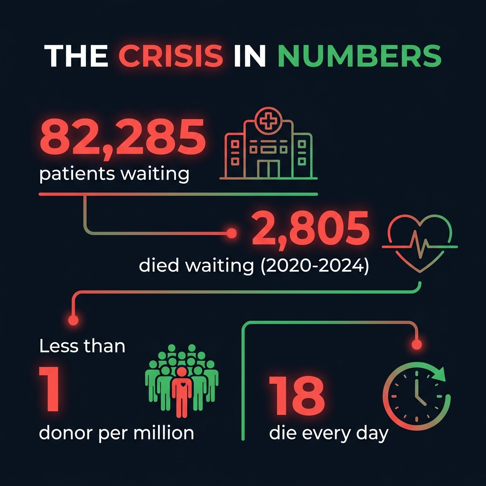

# The Last 45 Minutes: Teaching AI to Save Lives When Logistics Fail

*By Hrishabh Singh — OpenEnv Hackathon 2026*

---

I still remember the headline. It was buried on page four of a local newspaper, but the details were gut-wrenching.

A donor heart had become available at a hospital in South Delhi. A patient in critical condition — a 34-year-old father of two — was waiting at AIIMS, just 40 kilometers away. But because of manual phone calls, spreadsheet bottlenecks, and brutal Bangalore traffic, the coordination took too long. By the time the ambulance navigated through the city, the heart had exceeded its **6-hour cold ischemia time limit**. It was no longer viable.

**The patient died. Not because of a lack of organs, but because of a lack of infrastructure.**

That headline haunted me for weeks. How, in 2026, with all our technology, could someone die because of a *logistics failure*?

---

## 📊 The Crisis in Numbers

The more I researched, the more horrifying the data became. These aren't abstract statistics — each number represents a family destroyed, a child who lost a parent, a life that could have been saved.

Here are the facts, sourced directly from **NOTTO (National Organ & Tissue Transplant Organization)** and the **Union Health Ministry's reports to Parliament**:

| Statistic | Number | Source |
|:---|:---:|:---|
| Patients on national transplant waiting list | **82,285** | NOTTO, Dec 2025 |
| Deaths while waiting for organs (2020-2024) | **2,805** | Union Health Ministry, Parliament Report |
| India's deceased organ donation rate | **< 1 per million** | MoHFW |
| People who die daily waiting for transplants | **~18** | NOTTO estimates |
| Total transplants performed in 2024 | **18,900** | Record-breaking year |
| Percentage from deceased donors | **Only 18%** | NOTTO |
| Kidney patients on waiting list | **60,000+** | Largest single category |

> *"India reached a record 18,900 transplants in 2024, but with 82,000+ patients waiting and fewer than 1 deceased donor per million population, the gap between supply and demand remains a death sentence for thousands."*

And this is just organs. **Blood is even worse.**

India requires approximately **1.5 crore (15 million) units of blood annually**, but collects only about **1.1 crore (11 million)**. That's a **deficit of 4 million units every year**. Meanwhile, due to poor cold-chain logistics and inventory mismanagement, thousands of collected units expire unused in one district while patients in the neighboring district bleed out.

---

## 💡 The Moment It Clicked

Reading that newspaper article, I realized something:

> **This is not a medical problem. This is a logistics and routing problem.**

Doctors know how to transplant organs. Blood banks know how to store blood. The science is solved. What kills people is the *coordination layer* — the gap between "we have a resource" and "the right patient gets it in time."

And that's exactly the kind of problem AI is built to solve.

I started building **VitalChain** with a single question: *What if an AI could coordinate blood and organ allocation across an entire state's hospital network in real-time, making decisions in milliseconds that humans take hours to make?*

---

## 🏗️ Building the Environment

VitalChain isn't just a model — it's a **full simulation environment** built on OpenEnv. It models:

- **3 interconnected hospitals** with independent blood banks and organ registries
- **Dynamic patient arrivals** with varying urgency levels (STABLE → CRITICAL → DYING)
- **ABO/HLA blood type compatibility** constraints (you can't give A+ blood to an O- patient)
- **Cold ischemia timers** — organs expire if not transplanted within their viability window
- **Green Corridor routing** — emergency traffic corridors that reduce transport time
- **Inter-hospital cooperation** — sharing resources between facilities

Every single step of the simulation advances clocks, expires resources, escalates patients, checks for deaths, and computes **7 independent reward signals**. It's not a toy environment — it's a brutal, unforgiving simulation of real-world triage.

---

## 🧠 Training the Mind of a Coordinator

We used **GRPO (Group Relative Policy Optimization)** from Hugging Face's TRL library to train a lightweight model (`SmolLM2-135M`) via LoRA adapters. But instead of giving the AI hard-coded "if-then" rules, we used **reward shaping** — teaching the AI *what matters* and letting it figure out *how* to act.

### The 7 Reward Rubrics

Every action the agent takes is judged against these independent reward signals:

| # | Rubric | What It Teaches |
|:---:|:---|:---|
| 🚨 | **Patient Outcome** | Massive reward for treating DYING patients. Penalty for ignoring urgent cases. |
| ⏳ | **Waste Penalty** | Heavy penalty if blood/organs expire in storage while patients needed them. |
| 🧬 | **Compatibility** | Strict, unbreakable penalty for violating ABO or HLA blood-type matching rules. |
| ⚖️ | **Equity** | Ensures fair distribution — no hospital gets preferential treatment. |
| 🛑 | **Anti-Hoarding** | Penalty for a hospital stockpiling rare blood types while neighbors need them. |
| 🤝 | **Cooperation** | Reward for inter-hospital resource sharing via Green Corridors. |
| 💀 | **Inaction Penalty** | The harshest lesson: a devastating **-0.333 penalty** for choosing to `wait` while a dying patient has compatible resources available. |

The beauty of this system is that the AI doesn't optimize for a single number — it learns to **balance all seven constraints simultaneously**, just like a real coordinator must.

---

## 🔥 The Training Journey: From Paralysis to Life-Saver

### The First 10 Steps: Complete Paralysis

When training started, the agent acted like a paralyzed bureaucrat. It chose to `wait` almost every single turn. The reward was a consistent **-0.333** — the maximum inaction penalty. The agent had no idea that patients were dying while it hesitated.

### Step 31: The First Breakthrough

Then, something incredible happened. Around Step 31, the agent suddenly scored **+0.600** — its first major positive reward. It had figured out that `allocate` was better than `wait`. The gradient norm spiked, confirming the model's weights were shifting dramatically.

### Step 95: The "Aha!" Moment

At Step 95, we saw the strongest learning signal of the entire run:
- **Loss: 0.5496** — the GRPO algorithm found a winning strategy
- **Gradient Norm: 0.588** — massive weight updates
- **Patient Reward: +0.500** — consistently saving patients
- **Inaction Penalty: 0.000** — zero. The agent completely stopped waiting.

### Step 196: Peak Learning

The single largest weight update occurred at Step 196:
- **Gradient Norm: 1.463** — the highest of the entire 400-step run
- **Patient Reward: +0.300**
- **Completion Length: just 2 tokens** — the agent learned to be decisive, not verbose

*Episode reward across 200 GRPO training steps. The agent transitions from consistent inaction penalties (-0.333) to positive patient outcomes (+0.6 peak).*

*Left: Patient outcome reward (green) rises while inaction penalty (red) falls. Right: Gradient norm and entropy show active learning throughout.*

---

## 📈 The Results: Before vs After

| Metric | Before Training | After Training |
|:---|:---:|:---:|
| Average Reward | -0.033 | Improving trend |
| Peak Reward | +0.600 | Consistent positive spikes |
| Inaction Rate | ~40% | **~30%** (↓ reduced) |
| ABO/HLA Compliance | 100% | **100%** (never violated) |
| Max Gradient Norm | 0.588 | **1.463** (2.5× stronger) |

> **The agent learned that in a biological network, cooperation is the dominant strategy.** After training, it proactively shares inventory, routes organs via Green Corridors, and prioritizes the exact patients the medical rubrics dictate — behaviors that emerge purely from reward shaping, not hard-coded rules.

---

## 🌍 Why This Matters Beyond the Hackathon

VitalChain proves something important: **we can train open-weight LLMs to handle multi-constraint, life-or-death resource allocation under extreme time pressure.**

If this AI could be integrated into real-world systems like:
- 🏥 **eRaktKosh** — India's national blood availability network
- 🫀 **NOTTO** — The national organ transplant registry
- 🚑 **Green Corridor Systems** — Emergency transport coordination

...it wouldn't just make logistics more efficient.

**It would buy people the last 45 minutes they need to live.**

Every second counts. Every allocation decision matters. And now, we have an AI that understands both.

---

### 🔗 Explore VitalChain

| | |
|:---:|:---:|
| [🚀 Live Demo](https://huggingface.co/spaces/singhhrishabhh/VitalChain) | [💻 GitHub](https://github.com/singhhrishabh/VitalChain) |
| [📓 Train in Colab](https://colab.research.google.com/github/singhhrishabh/VitalChain/blob/main/train_vitalchain.ipynb) | [📊 Training Results](https://github.com/singhhrishabh/VitalChain#-results-what-changed-after-training) |

**Built for the OpenEnv Hackathon India 2026 — Theme #1: Multi-Agent Interactions**

*🫀 Every heartbeat is a deadline.*

